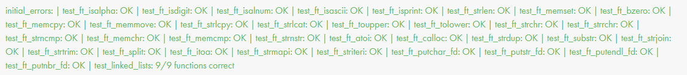

*This project has been created as part of the 42 curriculum by hyunlee.*

# Libft

## Result

<p align="center">
  
</p>
<p align="center">
  
</p>

## Description
Libft is a custom C library created for the 42 curriculum. The goal of the project is to reimplement a useful subset of the C standard library and add small utility functions that can be reused in later 42 projects.

The library builds into `libft.a`, a static archive containing character classification, memory manipulation, string handling, allocation helpers, file descriptor output functions, and linked list utilities.

### Library Contents

Character checks and conversions:
`ft_isalpha`, `ft_isdigit`, `ft_isalnum`, `ft_isascii`, `ft_isprint`, `ft_toupper`, `ft_tolower`

Memory functions:
`ft_memset`, `ft_bzero`, `ft_memcpy`, `ft_memmove`, `ft_memchr`, `ft_memcmp`, `ft_calloc`

String functions:
`ft_strlen`, `ft_strchr`, `ft_strrchr`, `ft_strncmp`, `ft_strlcpy`, `ft_strlcat`, `ft_strnstr`, `ft_strdup`, `ft_substr`, `ft_strjoin`, `ft_strtrim`, `ft_split`, `ft_strmapi`, `ft_striteri`

Conversion and output:
`ft_atoi`, `ft_itoa`, `ft_putchar_fd`, `ft_putstr_fd`, `ft_putendl_fd`, `ft_putnbr_fd`

Linked list utilities:
`ft_lstnew`, `ft_lstadd_front`, `ft_lstsize`, `ft_lstlast`, `ft_lstadd_back`, `ft_lstdelone`, `ft_lstclear`, `ft_lstiter`, `ft_lstmap`

## Instructions
Build the library:

```sh
make
```

Clean object files:

```sh
make clean
```

Remove object files and the static library:

```sh
make fclean
```

Rebuild from scratch:

```sh
make re
```

## Resources
- My Notion study notes: https://coconut-munchkin-952.notion.site/42gs-79872d44d901462c8b583fa5b48e7f03

AI assistance was used during the learning and verification process. First, each function to implement was given to the AI so that the required behavior from the relevant manual page could be translated and explained. Then, the AI was asked to generate small `main` programs with edge cases, which were used to test whether the manually implemented functions behaved correctly. Finally, the AI was used to update `libftTester` with more edge cases and broader test coverage, then the implemented code was tested with that upgraded tester: https://github.com/Leehyunbin0131/libftTester
